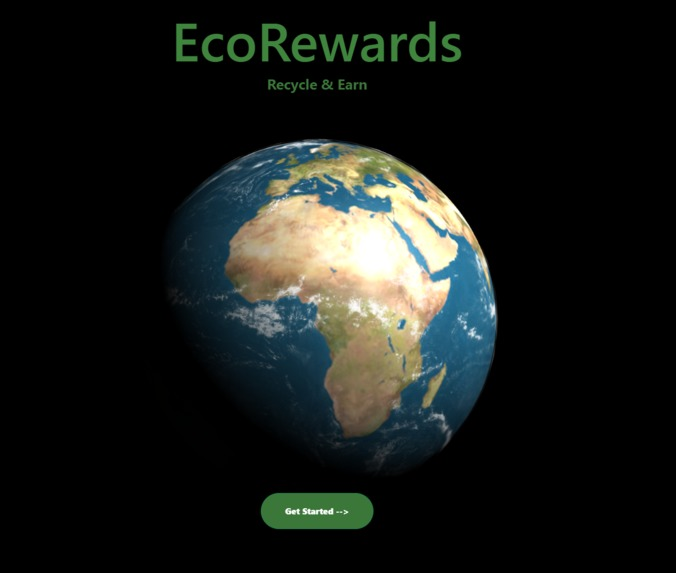
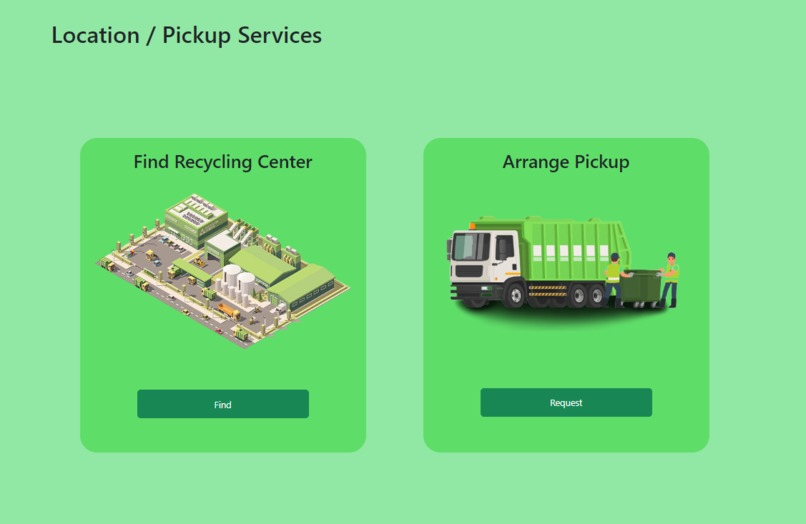
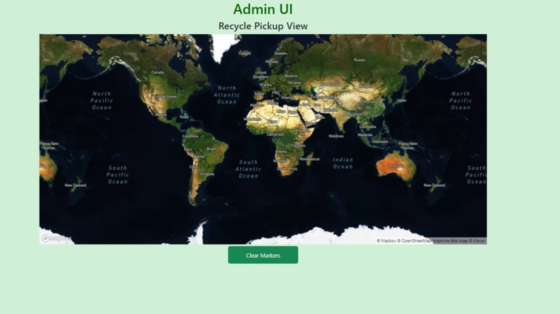

# EcoRewards - TrojanHacks S'23 Best Hack Winner

Made by Nicky Hama, Isaac Le, Jessica Lee

### Inspiration

As fuel for our project brainstorming, we wanted to tackle one of the most pressing issues in the world of sustainability: climate change. From here, we looked at things that we do in our daily lives that help alleviate climate change on a micro level as well as things that granted us fulfillment in terms of helping the cause when we landed upon the idea of recycling. We agreed that the recycling process is incredibly substandard and inefficient, so we set out to build a service that would streamline recycling in a way that incentivizes ending climate change.

### What it does
Our web service, EcoRewards, helps users find the closest recycling plant to them and provides directions to the plant. Furthermore, it searches for nearby users (within a 3 mile radius) and offers a pickup service for recyclables when enough users in the area intend to go recycling. This allows us to reduce the carbon emissions from multiple people in the same area driving to a recycling plant. Finally, EcoRewards implements a point system that translates to money, which replaces the previous system that recycling plants used in which they gave receipts that customers would have to redeem for cash.

### How we built it
We built EcoRewards using HTML, CSS, and a little bit of Java Script to build the website itself. Using the HTML5 Geolocation API, we were able to link Google Maps into our code and find nearby recycling plants relative to the user's current location. We also used Firebase to create a user database and keep track of each respective user's login information and history. We used Node,js, express.js and socket.io to send data between the client and admin interfaces.

### Challenges we ran into
Since we came into the project with different skill sets, the way in which we delegated work had to be efficient such that no member was left without doing work. One of us had to learn Firebase to create and maintain authentication and database functions since he didn't know any JS, HTML, or CSS, all of which were integral to building the website and implementing various API. Additionally, the process of building the website itself turned out to be much more tedious and detail-oriented than expected.

### Accomplishments that we're proud of
We're proud of the amount of work we put into building the website itself since we needed to have a relatively seamless integration between the artistic and functional aspect of our code. Additionally, we're proud that none of us gave up even though we were all tired from our various weeks of work.

### What we learned
We learned much about building a website with actual functionality, since we previously had only built websites with partial functionality in classroom settings. One member of the group also learned (mastered) to use firebase's authentication and realtime database features, since nobody knew how to use it.

### What's next for EcoRewards
Past this, EcoRewards is looking to take in data points from users to build a more comprehensive interface. Additionally, we want to work with government and local agencies to supply more recyclables to recycling plants such that we can maximize the amount of recycling done by the community.

### Built With 
- HTML / CSS
- JavaScript
- Node.js
- Three.js 
- Express.js
- Firebase
- Socket.io
- MapBox GL/JS
- HTML5 Geolocation API
